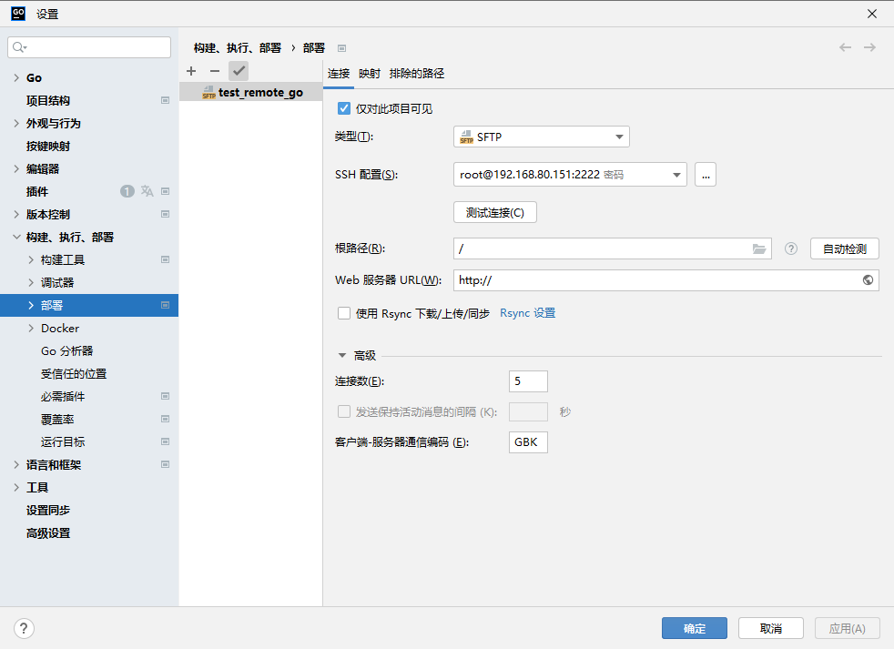
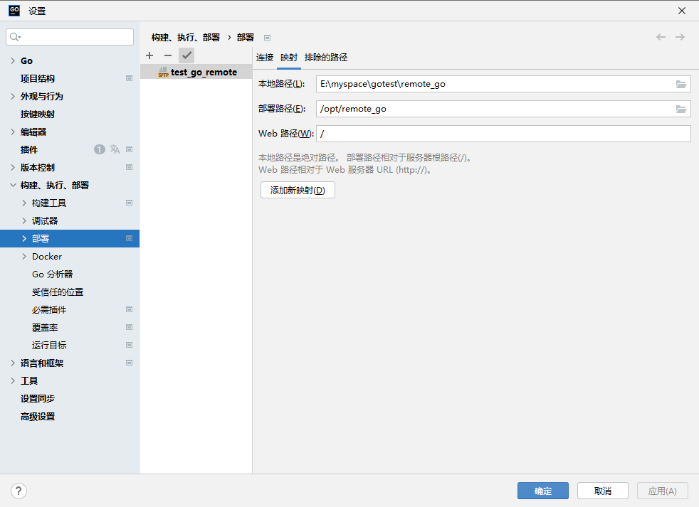
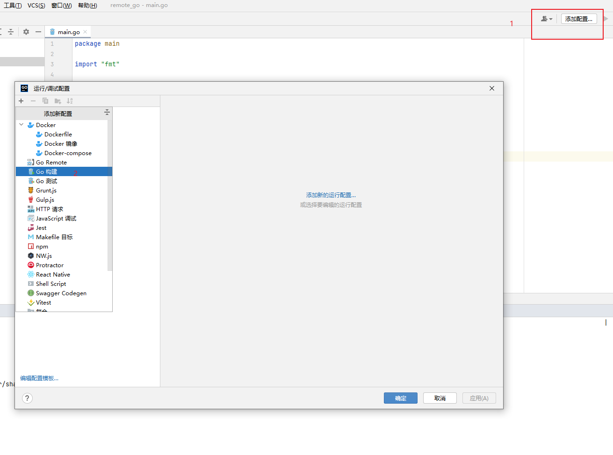
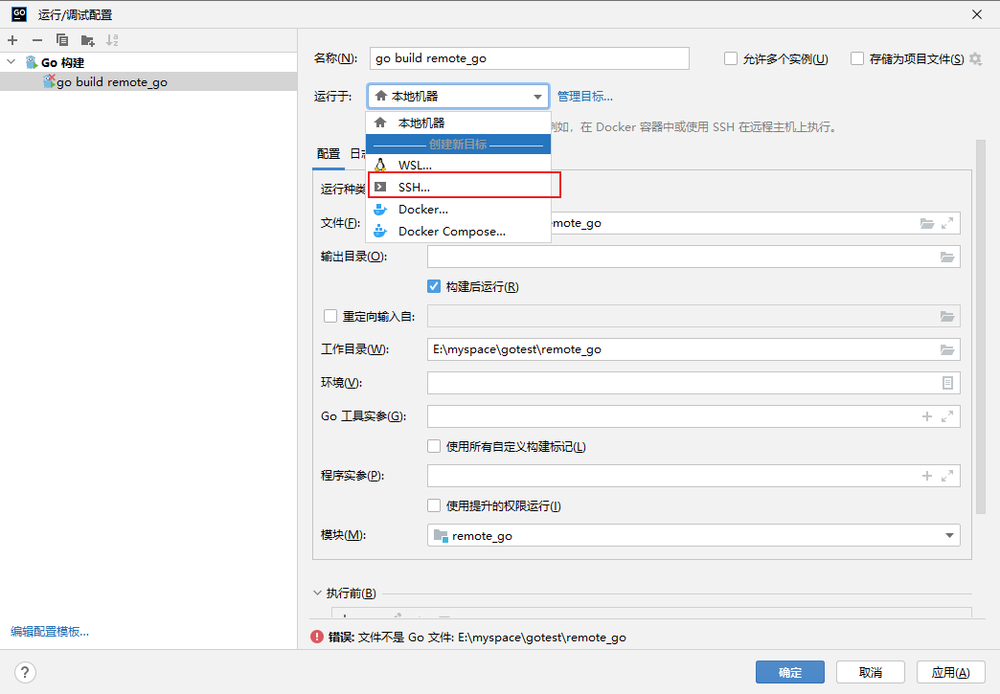

# 构建远程开发容器环境(Goland)

[保姆级从 0 到 1 讲解 go 远程开发环境搭建(从 Docker 安装到使用 Goland 远程部署和调试) - 掘金 (juejin.cn)](https://juejin.cn/post/7147327195747188744)

## 1. 创建有 sshd 的镜像和容器

拉取 centos7 镜像

```bash
# 拉取centos7 镜像
docker pull  centos:7
# 运行一个容器
docker run -it --name my_centos7 centos:7
# 退出后重新启动容器
docker start my_centos7
# 重新进入容器
docker exec -it my_centos7  /bin/bash
# 设置密码
echo 'root:123456'|chpasswd
```

安装 openssh 服务

```bash
yum install openssh-server -y
# 生成容器的公钥、私钥(一致按回车)
ssh-keygen -t rsa -f /etc/ssh/ssh_host_rsa_key
# 可以看到如下文件
#[root@6cf95fc38b39 /]# ls /etc/ssh
#moduli  ssh_host_rsa_key  ssh_host_rsa_key.pub  sshd_config
```

创建允许外部访问的认证文件

```bash
[root@6cf95fc38b39 /]# mkdir -p ~/.ssh
[root@6cf95fc38b39 /]# > ~/.ssh/authorized_keys
```

创建可执行文件,启动 sshd

```bash
cat > run_sshd.sh <<EOF
#! /bin/bash
/usr/sbin/sshd -D
EOF
chmod 755 run_sshd.sh
```

执行完上边的步骤就可以退出容器了

接下来要将当前的环境提交为一个新的镜像

```bash
docker stop my_centos7
docker commit my_centos7  zch/centos:7-ssh
```

通过新的镜像,启动一个容器

```bash
docker run -d --name centos7-ssh -p 2222:22 zch/centos:7-ssh /run_sshd.sh
```

-d 表示运行容器但不进入容器, /run.sh 表示运行之前创建的 /run.sh 文件

## 2. Goland 设置 Deployment





## 3. 设置远程 golang 环境

下载 go 安装包,通过 goland 上传到容器中,并解压

`tar zxf /opt/remote_go/go1.20.5.linux-amd64.tar.gz -C /usr/local/`

设置环境变量

```bash
cat >>/etc/profile <<EOF
export GOROOT=/usr/local/go
export GOPATH=\$HOME/go_path
export GOBIN=\$GOPATH/bin
export PATH=\$GOPATH:\$GOBIN:\$GOROOT/bin:\$PATH
EOF

source /etc/profile
```

生效 go 的代理

```bash
go env -w GO111MODULE=on
go env -w GOPROXY=https://goproxy.cn,direct
```

## 4. 测试远程连接

在 goland 的项目下,创建一个 go 文件,并同步到远程容器

```go
package main

import "fmt"

func main() {
	fmt.Println("123")
	a := 1
	b := a + 1
	fmt.Println(b)
	fmt.Println("234")
}
```

在远程和本地执行如下命令

`go install github.com/go-delve/delve/cmd/dlv@latest`

通过 goland,设置远程 go build





## 问题:

1. 远程 debug 时会断开,怀疑时 docker 端口没有映射,所以重新将上面的容器提交为镜像,并增加映射端口后,启动新的容器

could not launch process: fork/exec /root/remote_go/executables-t1X8URkZYX/\_\_\_110go_build_main_go_linux: operation not permitted
针对此错误,增加配置,增加调试权限`--cap-add=SYS_PTRACE `

```bash

docker run -d --name centos7-go3 -p 2222:22 --cap-add=SYS_PTRACE  zch/centos:7-go /run_sshd.sh
#docker run -d --name centos7-go1 -p 2222:22 --cap-add=SYS_PTRACE  --privileged   zch/centos:7-go /run_sshd.sh
```

2. 可以debug出结果,但是断点无效 
**_还需要 go.mod 文件(已解决)_**

`docker commit c14dfd6b10e4  centos7-go-debug`
