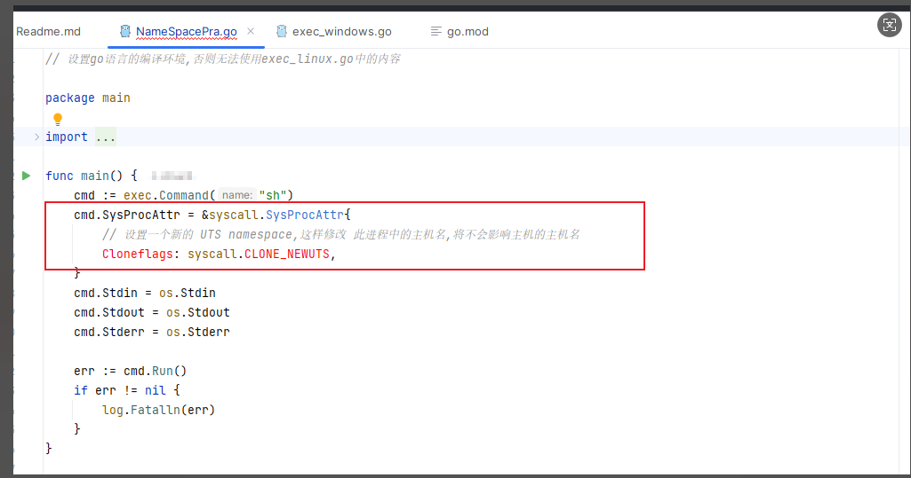
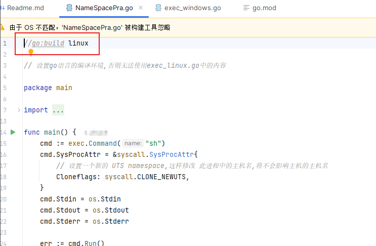
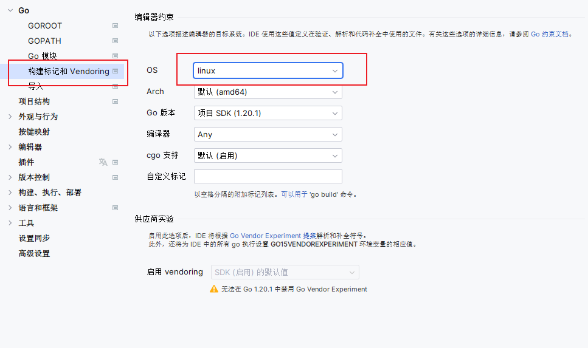

# windows 下 goland 使用 *_linux.go 代码

## 场景

在 Windows 下使用 GoLand, 无法使用 `syscall.CLONE_NEWUTS` 相关内容, 因为这些是卸载 exec_linux.go 文件中的, 从而无法被语法提示显示  

  

## 解决办法
需要在最开头加上: `//go:build linux`  
  

加上之后会提示 "由于 OS 不匹配 'NameSpacePra.go' 被构建工具忽略", 如果代码都是准备在Linux中运行的,可以设置GoLand的构建环境  
  