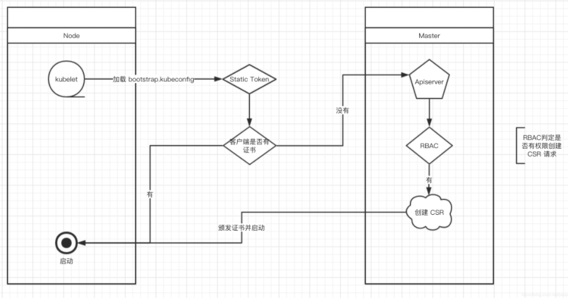
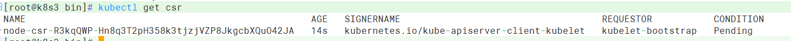
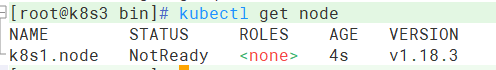

# k8s 二进制部署
## 1. 系统环境准备

| 主机名称  | ip             | 系统资源 | 部署服务 |
| --------- | -------------- | -------- | -------- |
| k8s3.node | 192.168.80.161 | 3G+45G   | etcd     |
| k8s4.node | 192.168.80.162 | 3G+45G   | etcd     |

- 关闭防火墙

- 关闭selinux

- 关闭swap

- 将集群内的主机配置到/etc/hosts

- 将桥接的 IPv4 流量传递到 iptables 的链,并生效

  ```bash
  # 将桥接的 IPv4 流量传递到 iptables 的链
  cat > /etc/sysctl.d/k8s.conf << EOF
  net.bridge.bridge-nf-call-ip6tables = 1
  net.bridge.bridge-nf-call-iptables = 1
  EOF
  # 生效
  sysctl --system 
  ```

- 简单的进行时间同步，保证时间一致 `ntpdate time.windows.com`

- 准备cfssl证书工具：cfssl 是一个开源的证书管理工具，使用 json 文件生成证书，相比 openssl 更方便使用。

  ```bash
  wget https://pkg.cfssl.org/R1.2/cfssl_linux-amd64
  wget https://pkg.cfssl.org/R1.2/cfssljson_linux-amd64
  wget https://pkg.cfssl.org/R1.2/cfssl-certinfo_linux-amd64
  chmod +x cfssl_linux-amd64 cfssljson_linux-amd64 cfssl-certinfo_linux-amd64
  mv cfssl_linux-amd64 /usr/local/bin/cfssl
  mv cfssljson_linux-amd64 /usr/local/bin/cfssljson
  mv cfssl-certinfo_linux-amd64 /usr/bin/cfssl-certinfo
  ```

  

## 2. 部署etcd集群

### 2.1 生成etcd自签证书


- 创建目录
```bash
mkdir -p ~/TLS/etcd && cd  ~/TLS/etcd
```

- 自签CA
```bash
cat > ca-config.json<< EOF
{
    "signing": {
        "default": {
            "expiry": "87600h"
        }, 
        "profiles": {
            "www": {
                "expiry": "87600h", 
                "usages": [
                    "signing", 
                    "key encipherment", 
                    "server auth", 
                    "client auth"
                ]
            }
        }
    }
}
EOF
cat > ca-csr.json<< EOF
{
    "CN": "etcd CA", 
    "key": {
        "algo": "rsa", 
        "size": 2048
    }, 
    "names": [
        {
            "C": "CN", 
            "L": "Beijing", 
            "ST": "Beijing"
        }
    ]
}
EOF

# 生成证书
cfssl gencert -initca ca-csr.json | cfssljson -bare ca -

# 查看文件
[root@localhost etcd]# ls *.pem
ca-key.pem  ca.pem
```

- 使用自签CA来签发etcd HTTPS证书

```bash
# 创建证书申请文件，文件 hosts 字段中 IP 为所有 etcd 节点的集群内部通信 IP，一个都不能少！为了方便后期扩容可以多写几个预留的 IP
cat > server-csr.json<< EOF
{
    "CN": "etcd", 
    "hosts": [
        "192.168.80.161", 
        "192.168.80.162", 
        "192.168.80.163"
    ], 
    "key": {
        "algo": "rsa", 
        "size": 2048
    }, 
    "names": [
        {
            "C": "CN", 
            "L": "BeiJing", 
            "ST": "BeiJing"
        }
    ]
}
EOF

# 生成证书
cfssl gencert -ca=ca.pem -ca-key=ca-key.pem -config=ca-config.json -profile=www server-csr.json | cfssljson -bare server

# 查看证书文件
[root@localhost etcd]# ls *.pem
ca-key.pem  ca.pem  server-key.pem  server.pem
```

### 2.2 安装etcd

下载 etcd 并解压 二进制包：https://github.com/etcd-io/etcd/releases/download/v3.4.9/etcd-v3.4.9-linux-amd64.tar.gz

```bash
mkdir -p /opt/etcd/{bin,cfg,ssl} 
tar zxvf  etcd-v3.4.9-linux-amd64.tar.gz 
mv etcd-v3.4.9-linux-amd64/{etcd,etcdctl} /opt/etcd/bin/
```

- 创建etcd配置文件

```bash
cat > /opt/etcd/cfg/etcd.conf << EOF
#[Member]
ETCD_NAME="etcd-1"
ETCD_DATA_DIR="/opt/etcd/data/default.etcd"
ETCD_LISTEN_PEER_URLS="https://192.168.80.161:2380"
ETCD_LISTEN_CLIENT_URLS="https://192.168.80.161:2379"
#[Clustering]
ETCD_INITIAL_ADVERTISE_PEER_URLS="https://192.168.80.161:2380"
ETCD_ADVERTISE_CLIENT_URLS="https://192.168.80.161:2379"
ETCD_INITIAL_CLUSTER="etcd-1=https://192.168.80.161:2380,etcd-2=https://192.168.80.162:2380"
ETCD_INITIAL_CLUSTER_TOKEN="etcd-cluster"
ETCD_INITIAL_CLUSTER_STATE="new"
EOF
```

配置项说明

> ETCD_NAME：节点名称，集群中唯一
> ETCD_DATA_DIR：数据目录
> ETCD_LISTEN_PEER_URLS：集群通信监听地址
> ETCD_LISTEN_CLIENT_URLS：客户端访问监听地址
> ETCD_INITIAL_ADVERTISE_PEER_URLS：集群通告地址
> ETCD_ADVERTISE_CLIENT_URLS：客户端通告地址
> ETCD_INITIAL_CLUSTER：集群节点地址
> ETCD_INITIAL_CLUSTER_TOKEN：集群 Token
> ETCD_INITIAL_CLUSTER_STATE：加入集群的当前状态，new 是新集群，existing 表示加入已有集群

- systemd 管理 etcd

```bash
cat > /usr/lib/systemd/system/etcd.service << EOF
[Unit]
Description=Etcd Server
After=network.target
After=network-online.target
Wants=network-online.target
[Service]
Type=notify
EnvironmentFile=/opt/etcd/cfg/etcd.conf
ExecStart=/opt/etcd/bin/etcd \
--cert-file=/opt/etcd/ssl/server.pem \
--key-file=/opt/etcd/ssl/server-key.pem \
--peer-cert-file=/opt/etcd/ssl/server.pem \
--peer-key-file=/opt/etcd/ssl/server-key.pem \
--trusted-ca-file=/opt/etcd/ssl/ca.pem \
--peer-trusted-ca-file=/opt/etcd/ssl/ca.pem \
--logger=zap
Restart=on-failure
LimitNOFILE=65536
[Install]
WantedBy=multi-user.target
EOF
```

- 拷贝证书

```bash
cp ~/TLS/etcd/ca*pem ~/TLS/etcd/server*pem /opt/etcd/ssl/
```

- 设置开机自启 并启动

```bash
systemctl daemon-reload
systemctl start etcd
systemctl enable etcd
```

- 将文件拷贝到另一台主机，并修改主机配置信息（因为将数据目录设置在了opt下，拷贝后，需要目标主机删除data目录）

```bash
scp -r /opt/etcd/ root@192.168.80.162:/opt/
scp /usr/lib/systemd/system/etcd.service root@192.168.80.162:/usr/lib/systemd/system/
```

```bash
cat > /opt/etcd/cfg/etcd.conf << EOF
#[Member]
#修改此处，节点 2 改为 etcd-2，节点 3 改为 etcd-3
ETCD_NAME="etcd-2"
ETCD_DATA_DIR="/opt/etcd/data/default.etcd"
#修改为第二台主机
ETCD_LISTEN_PEER_URLS="https://192.168.80.162:2380" 
#修改为第二台主机
ETCD_LISTEN_CLIENT_URLS="https://192.168.80.162:2379"
#[Clustering]
#修改为第二台主机
ETCD_INITIAL_ADVERTISE_PEER_URLS="https://192.168.80.162:2380"
#修改为第二台主机
ETCD_ADVERTISE_CLIENT_URLS="https://192.168.80.162:2379"
ETCD_INITIAL_CLUSTER="etcd-1=https://192.168.80.161:2380,etcd-2=https://192.168.80.162:2380"
ETCD_INITIAL_CLUSTER_TOKEN="etcd-cluster"
ETCD_INITIAL_CLUSTER_STATE="new"
EOF
```

- 启动第二台的etcd服务，并设置开机自启动

```bash
ETCDCTL_API=3 /opt/etcd/bin/etcdctl --cacert=/opt/etcd/ssl/ca.pem --cert=/opt/etcd/ssl/server.pem --key=/opt/etcd/ssl/server-key.pem --endpoints="https://192.168.80.161:2379,https://192.168.80.162:2379" endpoint health
#输出结果如下，服务启动正常
# https://192.168.80.162:2379 is healthy: successfully committed proposal: took = 20.528408ms
# https://192.168.80.161:2379 is healthy: successfully committed proposal: took = 20.828833ms
```

## 3. 安装docker

docker 要在每台主机安装，需要在每台主机下载

### 3.1 下载并解压二进制包

```bash
wget https://download.docker.com/linux/static/stable/x86_64/docker-19.03.9.tgz
tar zxvf docker-19.03.9.tgz
mv docker/* /usr/bin
```

### 3.2 systemd 管理 docker

```bash
cat > /usr/lib/systemd/system/docker.service << EOF
[Unit]
Description=Docker Application Container Engine
Documentation=https://docs.docker.com
After=network-online.target firewalld.service
Wants=network-online.target
[Service]
Type=notify
ExecStart=/usr/bin/dockerd
ExecReload=/bin/kill -s HUP $MAINPID
LimitNOFILE=infinity
LimitNPROC=infinity
LimitCORE=infinity
TimeoutStartSec=0
Delegate=yes
KillMode=process
Restart=on-failure
StartLimitBurst=3
StartLimitInterval=60s
[Install]
WantedBy=multi-user.target
EOF
```

### 3.3 创建配置文件，设置阿里云镜像加速器

```bash
# 获取自己的阿里云镜像加速器地址地址 https://cr.console.aliyun.com/
cat > /etc/docker/daemon.json << EOF
{
  "registry-mirrors": ["https://ecu3g632.mirror.aliyuncs.com"]
}
EOF
```

### 3.4 设置开启自启动，并启动docker

```python
systemctl daemon-reload
systemctl start docker
systemctl enable docker
```

## 4. 部署MasterNode

### 4.1 生成kube-apiserver 证书

- 自签证书颁发机构（CA）

```bash
mkdir ~/TLS/k8s && cd ~/TLS/k8s
cat > ca-config.json<< EOF
{
    "signing": {
        "default": {
            "expiry": "87600h"
        }, 
        "profiles": {
            "kubernetes": {
                "expiry": "87600h", 
                "usages": [
                    "signing", 
                    "key encipherment", 
                    "server auth", 
                    "client auth"
                ]
            }
        }
    }
}
EOF
cat > ca-csr.json<< EOF
{
    "CN": "kubernetes", 
    "key": {
        "algo": "rsa", 
        "size": 2048
    }, 
    "names": [
        {
            "C": "CN", 
            "L": "Beijing", 
            "ST": "Beijing", 
            "O": "k8s", 
            "OU": "System"
        }
    ]
}
EOF
```

- 生成自签CA

```bash
cfssl gencert -initca ca-csr.json | cfssljson -bare ca -

#查看生成的证书
[root@localhost k8s]# ls *.pem
ca-key.pem  ca.pem
```

- 使用自签 CA 签发 kube-apiserver HTTPS 证书

```bash
cat > server-csr.json<< EOF
{
    "CN": "kubernetes", 
    "hosts": [
        "10.0.0.1", 
        "127.0.0.1", 
        "192.168.80.161", 
        "192.168.80.162", 
        "192.168.80.163", 
        "192.168.80.164", 
        "kubernetes", 
        "kubernetes.default", 
        "kubernetes.default.svc", 
        "kubernetes.default.svc.cluster", 
        "kubernetes.default.svc.cluster.local"
    ], 
    "key": {
        "algo": "rsa", 
        "size": 2048
    }, 
    "names": [
        {
            "C": "CN", 
            "L": "BeiJing", 
            "ST": "BeiJing", 
            "O": "k8s", 
            "OU": "System"
        }
    ]
}
EOF

# 生成证书
cfssl gencert -ca=ca.pem -ca-key=ca-key.pem -config=ca-config.json -profile=kubernetes server-csr.json | cfssljson -bare server

# 查看证书文件
[root@localhost k8s]# ls *.pem
ca-key.pem  ca.pem  server-key.pem  server.pem
```

### 4.2 下载二进制包

地址：https://github.com/kubernetes/kubernetes/blob/master/CHANGELOG/CHANGELOG-1.18.md#v1183

打开链接你会发现里面有很多包，下载一个 server 包就够了，包含了 Master 和Worker Node 二进制文件。

```bash
mkdir -p /opt/kubernetes/{bin,cfg,ssl,logs}
tar zxvf kubernetes-server-linux-amd64.tar.gz
cd kubernetes/server/bin
cp kube-apiserver kube-scheduler kube-controller-manager /opt/kubernetes/bin
cp kubectl /usr/bin/
```

### 4.3 创建kube-apiserver配置文件

```bash
cat > /opt/kubernetes/cfg/kube-apiserver.conf << EOF 
KUBE_APISERVER_OPTS="--logtostderr=false \\
--v=2 \\
--log-dir=/opt/kubernetes/logs \\
--etcd-servers=https://192.168.80.161:2379,https://192.168.80.162:2379 \\
--bind-address=192.168.80.161 \\
--secure-port=6443 \\
--advertise-address=192.168.80.161 \\
--allow-privileged=true \\
--service-cluster-ip-range=10.0.0.0/24 \\
--enable-admission-plugins=NamespaceLifecycle,LimitRanger,ServiceAccount,ResourceQuota,NodeRestriction \\
--authorization-mode=RBAC,Node \\
--enable-bootstrap-token-auth=true \\
--token-auth-file=/opt/kubernetes/cfg/token.csv \\
--service-node-port-range=30000-32767 \\
--kubelet-client-certificate=/opt/kubernetes/ssl/server.pem \\
--kubelet-client-key=/opt/kubernetes/ssl/server-key.pem \\
--tls-cert-file=/opt/kubernetes/ssl/server.pem \\
--tls-private-key-file=/opt/kubernetes/ssl/server-key.pem \\
--client-ca-file=/opt/kubernetes/ssl/ca.pem \\
--service-account-key-file=/opt/kubernetes/ssl/ca-key.pem \\
--etcd-cafile=/opt/etcd/ssl/ca.pem \\
--etcd-certfile=/opt/etcd/ssl/server.pem \\
--etcd-keyfile=/opt/etcd/ssl/server-key.pem \\
--audit-log-maxage=30 \\
--audit-log-maxbackup=3 \\
--audit-log-maxsize=100 \\
--audit-log-path=/opt/kubernetes/logs/k8s-audit.log" 
EOF
```

注：上面两个\ \ 第一个是转义符，第二个是换行符，使用转义符是为了使用 EOF 保留换行符。

> –logtostderr：启用日志
> —v：日志等级
> –log-dir：日志目录
> –etcd-servers：etcd 集群地址
> –bind-address：监听地址
> –secure-port：https 安全端口
> –advertise-address：集群通告地址
> –allow-privileged：启用授权
> –service-cluster-ip-range：Service 虚拟 IP 地址段
> –enable-admission-plugins：准入控制模块
> –authorization-mode：认证授权，启用 RBAC 授权和节点自管理
> –enable-bootstrap-token-auth：启用 TLS bootstrap 机制
> –token-auth-file：bootstrap token 文件
> –service-node-port-range：Service nodeport 类型默认分配端口范围
> –kubelet-client-xxx：apiserver 访问 kubelet 客户端证书
> –tls-xxx-file：apiserver https 证书
> –etcd-xxxfile：连接 Etcd 集群证书
> –audit-log-xxx：审计日志

### 4.4 拷贝生成的证书

```bash
cp ~/TLS/k8s/ca*pem ~/TLS/k8s/server*pem /opt/kubernetes/ssl/
```

### 4.5 启用 TLS Bootstrapping 机制

TLS Bootstraping：Master apiserver 启用 TLS 认证后，Node 节点 kubelet 和 kube-proxy 要与 kube-apiserver 进行通信，必须使用 CA 签发的有效证书才可以，当 Node节点很多时，这种客户端证书颁发需要大量工作，同样也会增加集群扩展复杂度。为了简化流程，Kubernetes 引入了 TLS bootstraping 机制来自动颁发客户端证书，kubelet会以一个低权限用户自动向 apiserver 申请证书，kubelet 的证书由 apiserver 动态签署。所以强烈建议在 Node 上使用这种方式，目前主要用于 kubelet，kube-proxy 还是由我们统一颁发一个证书。TLS bootstraping 工作流程：



创建上述配置文件中 token 文件：

```bash
cat > /opt/kubernetes/cfg/token.csv << EOF
03c853e0d9d6ebad91062b603a26f656,kubelet-bootstrap,10001,"system:node-bootstrapper"
EOF
```

```bash
格式：token，用户名，UID，用户组
token 也可自行生成替换：
head -c 16 /dev/urandom | od -An -t x | tr -d ' '
```


### 4.6 systemd管理apiserver

```bash
cat > /usr/lib/systemd/system/kube-apiserver.service << EOF
[Unit]
Description=Kubernetes API Server
Documentation=https://github.com/kubernetes/kubernetes
[Service]
EnvironmentFile=/opt/kubernetes/cfg/kube-apiserver.conf
ExecStart=/opt/kubernetes/bin/kube-apiserver \$KUBE_APISERVER_OPTS
Restart=on-failure
[Install]
WantedBy=multi-user.target
EOF
```

### 4.7 启动并设置开机启动

```bash
systemctl daemon-reload
systemctl start kube-apiserver
systemctl enable kube-apiserver
```

### 4.8 授权 kubelet-bootstrap 用户允许请求证书

```bash
kubectl create clusterrolebinding kubelet-bootstrap \
--clusterrole=system:node-bootstrapper \
--user=kubelet-bootstrap
# clusterrolebinding.rbac.authorization.k8s.io/kubelet-bootstrap created
```

### 4.9 部署 kube-controller-manager

- 创建配置文件

```bash
cat > /opt/kubernetes/cfg/kube-controller-manager.conf << EOF
KUBE_CONTROLLER_MANAGER_OPTS="--logtostderr=false \\
--v=2 \\
--log-dir=/opt/kubernetes/logs \\
--leader-elect=true \\
--master=127.0.0.1:8080 \\
--bind-address=127.0.0.1 \\
--allocate-node-cidrs=true \\
--cluster-cidr=10.244.0.0/16 \\
--service-cluster-ip-range=10.0.0.0/24 \\
--cluster-signing-cert-file=/opt/kubernetes/ssl/ca.pem \\
--cluster-signing-key-file=/opt/kubernetes/ssl/ca-key.pem \\
--root-ca-file=/opt/kubernetes/ssl/ca.pem \\
--service-account-private-key-file=/opt/kubernetes/ssl/ca-key.pem \\
--experimental-cluster-signing-duration=87600h0m0s"
EOF
```

> –master：通过本地非安全本地端口 8080 连接 apiserver。
> –leader-elect：当该组件启动多个时，自动选举（HA）
> –cluster-signing-cert-file/–cluster-signing-key-file：自动为 kubelet 颁发证书的 CA，与 apiserver 保持一致

- systemd 管理 controller-manager

```bash
cat > /usr/lib/systemd/system/kube-controller-manager.service << EOF 
[Unit]
Description=Kubernetes Controller Manager
Documentation=https://github.com/kubernetes/kubernetes
[Service]
EnvironmentFile=/opt/kubernetes/cfg/kube-controller-manager.conf
ExecStart=/opt/kubernetes/bin/kube-controller-manager \$KUBE_CONTROLLER_MANAGER_OPTS
Restart=on-failure
[Install]
WantedBy=multi-user.target
EOF
```

- 启动并设置开机启动

```bash
systemctl daemon-reload
systemctl start kube-controller-manager
systemctl enable kube-controller-manager
```

### 4.10 部署 kube-scheduler

- 创建配置文件

```bash
cat > /opt/kubernetes/cfg/kube-scheduler.conf << EOF 
KUBE_SCHEDULER_OPTS="--logtostderr=false \
--v=2 \
--log-dir=/opt/kubernetes/logs \
--leader-elect \
--master=127.0.0.1:8080 \
--bind-address=127.0.0.1"
EOF
```

> –master：通过本地非安全本地端口 8080 连接 apiserver。
> –leader-elect：当该组件启动多个时，自动选举（HA）

- systemd 管理 scheduler

```bash
cat > /usr/lib/systemd/system/kube-scheduler.service << EOF 
[Unit]
Description=Kubernetes Scheduler
Documentation=https://github.com/kubernetes/kubernetes
[Service]
EnvironmentFile=/opt/kubernetes/cfg/kube-scheduler.conf
ExecStart=/opt/kubernetes/bin/kube-scheduler \$KUBE_SCHEDULER_OPTS
Restart=on-failure
[Install]
WantedBy=multi-user.target
EOF
```

- 启动并设置开机启动

```bash
systemctl daemon-reload
systemctl start kube-scheduler
systemctl enable kube-scheduler
```

### 4.11 查看集群状态

MasterNode所有组件都已经启动成功，通过 kubectl 工具查看当前集群组件状态：

```bash
[root@k8s3 ~]# kubectl get cs
NAME                 STATUS    MESSAGE             ERROR
scheduler            Healthy   ok                  
controller-manager   Healthy   ok                  
etcd-0               Healthy   {"health":"true"}   
etcd-1               Healthy   {"health":"true"}
# 说明节点正常
```

## 5. 部署work

下面还是在 Master Node 上操作，即同时作为 Worker Node

### 5.1 创建工作目录并拷贝二进制文件

在所有 worker node 创建工作目录：

```bash
mkdir -p /opt/kubernetes/{bin,cfg,ssl,logs}
cd /root/package/kubernetes/server/bin #解压出的目录
cp kubelet kube-proxy /opt/kubernetes/bin # 本地拷贝
```

### 5.2 部署kubelet

- 创建配置文件

```bash
cat > /opt/kubernetes/cfg/kubelet.conf << EOF 
KUBELET_OPTS="--logtostderr=false \\
--v=2 \\
--log-dir=/opt/kubernetes/logs \\
--hostname-override=k8s1.node \\
--network-plugin=cni \\
--kubeconfig=/opt/kubernetes/cfg/kubelet.kubeconfig \\
--bootstrap-kubeconfig=/opt/kubernetes/cfg/bootstrap.kubeconfig \\
--config=/opt/kubernetes/cfg/kubelet-config.yml \\
--cert-dir=/opt/kubernetes/ssl \\
--pod-infra-container-image=lizhenliang/pause-amd64:3.0"
EOF
```

> –hostname-override：显示名称，集群中唯一
> –network-plugin：启用 CNI
> –kubeconfig：空路径，会自动生成，后面用于连接 apiserver
> –bootstrap-kubeconfig：首次启动向 apiserver 申请证书
> –config：配置参数文件
> –cert-dir：kubelet 证书生成目录
> –pod-infra-container-image：管理 Pod 网络容器的镜像

- 配置参数文件

```bash
cat > /opt/kubernetes/cfg/kubelet-config.yml << EOF 
kind: KubeletConfiguration
apiVersion: kubelet.config.k8s.io/v1beta1
address: 0.0.0.0
port: 10250
readOnlyPort: 10255
cgroupDriver: cgroupfs
clusterDNS:
- 10.0.0.2
clusterDomain: cluster.local
failSwapOn: false
authentication:
    anonymous:
        enabled: false
    webhook:
        cacheTTL: 2m0s
        enabled: true
    x509:
        clientCAFile: /opt/kubernetes/ssl/ca.pem
authorization:
    mode: Webhook
    webhook:
        cacheAuthorizedTTL: 5m0s
        cacheUnauthorizedTTL: 30s
evictionHard:
imagefs.available: 15%
memory.available: 100Mi
nodefs.available: 10%
nodefs.inodesFree: 5%
maxOpenFiles: 1000000
maxPods: 110
EOF
```

- 生成 bootstrap.kubeconfig 文件

```bash
KUBE_APISERVER="https://192.168.80.161:6443" # apiserver IP:PORT
TOKEN="03c853e0d9d6ebad91062b603a26f656" # 与 token.csv 里保持一致
# 生成 kubelet bootstrap kubeconfig 配置文件
kubectl config set-cluster kubernetes \
--certificate-authority=/opt/kubernetes/ssl/ca.pem \
--embed-certs=true \
--server=${KUBE_APISERVER} \
--kubeconfig=bootstrap.kubeconfig
kubectl config set-credentials "kubelet-bootstrap" \
--token=${TOKEN} \
--kubeconfig=bootstrap.kubeconfig
kubectl config set-context default \
--cluster=kubernetes \
--user="kubelet-bootstrap" \
--kubeconfig=bootstrap.kubeconfig
kubectl config use-context default --kubeconfig=bootstrap.kubeconfig
```

- 拷贝到配置文件路径：

```bash
cp bootstrap.kubeconfig /opt/kubernetes/cfg
```

- systemd 管理 kubelet

```bash
cat > /usr/lib/systemd/system/kubelet.service << EOF
[Unit]
Description=Kubernetes Kubelet
After=docker.service
[Service]
EnvironmentFile=/opt/kubernetes/cfg/kubelet.conf
ExecStart=/opt/kubernetes/bin/kubelet \$KUBELET_OPTS
Restart=on-failure
LimitNOFILE=65536
[Install]
WantedBy=multi-user.target
EOF
```

- 启动并设置开机启动

```bash
systemctl daemon-reload
systemctl start kubelet
systemctl enable kubelet
```

- 批准 kubelet 证书申请并加入集群 

```bash
# 查看 kubelet 证书请求
kubectl get csr

# 批准申请
kubectl certificate approve node-csr-R3kqQWP-Hn8q3T2pH358k3tjzjVZP8JkgcbXQuO42JA
# 查看节点
kubectl get node
```





注：由于网络插件还没有部署，节点会没有准备就绪 NotReady

### 5.3 部署 kube-proxy

- 创建配置文件

```bash
cat > /opt/kubernetes/cfg/kube-proxy.conf << EOF 
KUBE_PROXY_OPTS="--logtostderr=false \\
--v=2 \\
--log-dir=/opt/kubernetes/logs \\
--config=/opt/kubernetes/cfg/kube-proxy-config.yml"
EOF
```

- 配置参数文件（**注意kubeconfig缩进，坑死我**）

```bash
cat > /opt/kubernetes/cfg/kube-proxy-config.yml << EOF 
kind: KubeProxyConfiguration
apiVersion: kubeproxy.config.k8s.io/v1alpha1
bindAddress: 0.0.0.0
metricsBindAddress: 0.0.0.0:10249
clientConnection:
    kubeconfig: /opt/kubernetes/cfg/kube-proxy.kubeconfig
hostnameOverride: k8s3.node
clusterCIDR: 10.0.0.0/24
EOF
```

- 生成 kube-proxy.kubeconfig 文件	
  - 生成 kube-proxy 证书

  ```bash
  # 切换工作目录
  cd ~/TLS/k8s
  # 创建证书请求文件
  cat > kube-proxy-csr.json<< EOF
  {
      "CN": "system:kube-proxy", 
      "hosts": [ ], 
      "key": {
          "algo": "rsa", 
          "size": 2048
      }, 
      "names": [
          {
              "C": "CN", 
              "L": "BeiJing", 
              "ST": "BeiJing", 
              "O": "k8s", 
              "OU": "System"
          }
      ]
  }
  EOF
  # 生成证书
  cfssl gencert -ca=ca.pem -ca-key=ca-key.pem -config=ca-config.json -profile=kubernetes kube-proxy-csr.json | cfssljson -bare kube-proxy
  # 查看结果
  [root@k8s3 k8s]# ls *proxy*.pem
  kube-proxy-key.pem  kube-proxy.pem
  ```

  - 生成 kubeconfig 文件

  ```bash
  KUBE_APISERVER="https://192.168.80.161:6443"
  kubectl config set-cluster kubernetes \
  --certificate-authority=/opt/kubernetes/ssl/ca.pem \
  --embed-certs=true \
  --server=${KUBE_APISERVER} \
  --kubeconfig=/opt/kubernetes/cfg/kube-proxy.kubeconfig
  kubectl config set-credentials kube-proxy \
  --client-certificate=/opt/kubernetes/ssl/kube-proxy.pem \
  --client-key=/opt/kubernetes/ssl/kube-proxy-key.pem \
  --embed-certs=true \
  --kubeconfig=/opt/kubernetes/cfg/kube-proxy.kubeconfig
  kubectl config set-context default \
  --cluster=kubernetes \
  --user=kube-proxy \
  --kubeconfig=/opt/kubernetes/cfg/kube-proxy.kubeconfig
  kubectl config use-context default --kubeconfig=/opt/kubernetes/cfg/kube-proxy.kubeconfig
  ```

  - 如果未指定全路径，要拷贝到配置文件指定路径: `cp kube-proxy.kubeconfig /opt/kubernetes/cfg/`

- systemd 管理 kube-proxy

  ```bash
  cat > /usr/lib/systemd/system/kube-proxy.service << EOF
  [Unit]
  Description=Kubernetes Proxy
  After=network.target
  [Service]
  EnvironmentFile=/opt/kubernetes/cfg/kube-proxy.conf
  ExecStart=/opt/kubernetes/bin/kube-proxy \$KUBE_PROXY_OPTS
  Restart=on-failure
  LimitNOFILE=65536
  [Install]
  WantedBy=multi-user.target
  EOF
  ```

- 启动并设置开机启动

  ```bash
  systemctl daemon-reload
  systemctl start kube-proxy
  systemctl enable kube-proxy
  ```

### 5.4 部署 CNI 网络

- 下载 CNI 二进制文件：`wget https://github.com/containernetworking/plugins/releases/download/v0.8.6/cni-plugins-linux-amd64-v0.8.6.tgz`

```bash
mkdir -p /opt/cni/bin
tar zxvf cni-plugins-linux-amd64-v0.8.6.tgz -C /opt/cni/bin
```

- 部署 CNI 网络

```bash
wget https://raw.githubusercontent.com/coreos/flannel/master/Documentation/kube-flannel.yml
# 默认镜像地址无法访问，修改为 docker hub 镜像仓库。
sed -i -r "s#quay.io/coreos/flannel:.*-amd64#lizhenliang/flannel:v0.12.0-amd64#g" kube-flannel.yml

kubectl apply -f kube-flannel.yml

# 查看状态
[root@k8s3 package]# kubectl get pods -n kube-flannel
NAME                    READY   STATUS     RESTARTS   AGE
kube-flannel-ds-n5brx   0/1     Init:0/2   0          25s
[root@k8s3 package]# kubectl get no
NAME        STATUS     ROLES    AGE   VERSION
k8s1.node   NotReady   <none>   14m   v1.18.3
```

### 5.5 授权 apiserver 访问 kubelet

```bash
cat > apiserver-to-kubelet-rbac.yaml<< EOF
apiVersion: rbac.authorization.k8s.io/v1
kind: ClusterRole
metadata:
    annotations:
        rbac.authorization.kubernetes.io/autoupdate: "true"
    labels:
        kubernetes.io/bootstrapping: rbac-defaults
    name: system:kube-apiserver-to-kubelet
rules:
    - apiGroups:
        - ""
      resources:
        - nodes/proxy
        - nodes/stats
        - nodes/log
        - nodes/spec
        - nodes/metrics
        - pods/log
      verbs:
        - "*"
---
apiVersion: rbac.authorization.k8s.io/v1
kind: ClusterRoleBinding
metadata:
    name: system:kube-apiserver
    namespace: ""
roleRef:
    apiGroup: rbac.authorization.k8s.io
    kind: ClusterRole
    name: system:kube-apiserver-to-kubelet
subjects:
    - apiGroup: rbac.authorization.k8s.io
      kind: User
      name: kubernetes
EOF

kubectl apply -f apiserver-to-kubelet-rbac.yaml
```

```bash
# 查看节点已正常
[root@k8s3 package]# kubectl get no
NAME        STATUS   ROLES    AGE   VERSION
k8s1.node   Ready    <none>   17m   v1.18.3
```

### 5.6 部署其他workNode

- 在 master 节点将 Worker Node 涉及文件拷贝到新节点

```bash
scp -r /opt/kubernetes root@192.168.80.162:/opt/
scp -r /usr/lib/systemd/system/{kubelet,kube-proxy}.service root@192.168.80.162:/usr/lib/systemd/system
scp -r /opt/cni/ root@192.168.80.162:/opt/
scp /opt/kubernetes/ssl/ca.pem root@192.168.80.162:/opt/kubernetes/ssl
```

- 删除 kubelet 证书和 kubeconfig 文件

```bash
rm /opt/kubernetes/cfg/kubelet.kubeconfig
rm -f /opt/kubernetes/ssl/kubelet*
```

注：这几个文件是证书申请审批后自动生成的，每个 Node 不同，必须删除重新生成。

- 修改主机名

  ```bash
  vi /opt/kubernetes/cfg/kubelet.conf
  --hostname-override=k8s2.node
  
  vi /opt/kubernetes/cfg/kube-proxy-config.yml
  hostnameOverride: k8s2.node
  ```

- 设置开机自启动

```bash
systemctl daemon-reload
systemctl start kubelet
systemctl enable kubelet
systemctl start kube-proxy
systemctl enable kube-proxy
```

- 在 Master 上批准新 Node kubelet 证书申请

```bash
[root@k8s3 package]# kubectl get csr
NAME                                                   AGE   SIGNERNAME                                    REQUESTOR           CONDITION
node-csr-R3kqQWP-Hn8q3T2pH358k3tjzjVZP8JkgcbXQuO42JA   26m   kubernetes.io/kube-apiserver-client-kubelet   kubelet-bootstrap   Approved,Issued
node-csr-lr_w8jwDJcyYOMWn-U3osza_vMemUhAH3PZ1MgBF6lY   37s   kubernetes.io/kube-apiserver-client-kubelet   kubelet-bootstrap   Pending

kubectl certificate approve node-csr-lr_w8jwDJcyYOMWn-U3osza_vMemUhAH3PZ1MgBF6lY
```

- 等待cni网络插件部署后，node回复正常

```bash
[root@k8s3 package]# kubectl get no
NAME        STATUS   ROLES    AGE    VERSION
k8s1.node   Ready    <none>   29m    v1.18.3
k8s2.node   Ready    <none>   3m5s   v1.18.3
```

## 6. 问题

/opt/kubernetes/cfg/kubelet.conf 和 /opt/kubernetes/cfg/kube-proxy-config.yml 中的hostnameOverride填写的主机名和实际主机名出入，导致get node获取到的主机名和实际主机名不一致。需要修改两个node中两个配置的主机名，

### 6.1 修改node节点名称的解决办法

1、使用 `kubectl drain` 命令驱逐节点上Pod

```bash
kubectl drain k8s2.node --delete-local-data --ignore-daemonsets
```

2、使用 `kubectl delete node` 命令删除需要改名的节点

```bash
kubectl delete node k8s2.node
```

3、停止对应node节点的 `kubelet` 和 `kube-proxy` 服务

```bash
[root@k8s4 ~]# systemctl stop kubelet
[root@k8s4 ~]# systemctl stop kube-proxy
```

4、修改 `kubelet.conf` 和 `kube-proxy-config.yml` 配置

```bash
[root@k8s4 ~]# grep -H k8s2.node /opt/kubernetes/cfg/*
/opt/kubernetes/cfg/kubelet.conf:--hostname-override=k8s2.node \
/opt/kubernetes/cfg/kube-proxy-config.yml:hostnameOverride: k8s2.node

# 修改这两个文件的主机名
```

5、删除 kubelet 服务生成的`认证文件`和`客户端证书`

```bash
rm /opt/kubernetes/cfg/kubelet.kubeconfig
rm -f /opt/kubernetes/ssl/kubelet*
```

6、启动 `kubelet` 和 `kube-proxy` 服务

```bash
systemctl start kubelet
systemctl start kube-proxy
```

7、使用命令 `kubectl get csr` 和 `kubectl certificate approve` 命令授权 node节点加入

```bash
[root@k8s3 ~]# kubectl get csr
NAME                                                   AGE   SIGNERNAME                                    REQUESTOR           CONDITION
node-csr-OiXW1sY3b0U-66Sq0oYRosPFB7nSngmWLZ1HqeB67rU   43s   kubernetes.io/kube-apiserver-client-kubelet   kubelet-bootstrap   Pending
node-csr-R3kqQWP-Hn8q3T2pH358k3tjzjVZP8JkgcbXQuO42JA   21h   kubernetes.io/kube-apiserver-client-kubelet   kubelet-bootstrap   Approved,Issued
node-csr-lr_w8jwDJcyYOMWn-U3osza_vMemUhAH3PZ1MgBF6lY   21h   kubernetes.io/kube-apiserver-client-kubelet   kubelet-bootstrap   Approved,Issued

kubectl certificate approve node-csr-OiXW1sY3b0U-66Sq0oYRosPFB7nSngmWLZ1HqeB67rU
```

### 6.2 flannel 插件对应的pod启动失败（不应采纳）

```bash
E0215 14:25:13.297928       1 main.go:221] Failed to create SubnetManager: error retrieving pod spec for 'kube-flannel/kube-flannel-ds-fxvxz': Get "https://10.0.0.1:443/api/v1/namespaces/kube-flannel/pods/kube-flannel-ds-fxvxz": dial tcp 10.0.0.1:443: connect: connection refused
```

修改 kube-flannel.yaml中的配置 `- --kube-subnet-mgr=false` 

一些资料

> 这个错误通常表示 Flannel pod 无法连接到 Kubernetes API server。在 Kubernetes 中，Flannel 通过 Kubernetes API server 分配网络地址空间，并将其分配给工作节点，因此如果 Flannel 无法连接到 Kubernetes API server，则无法启动。
>
> 有几个可能的原因导致这个问题：
>
> 1. Kubernetes API server 宕机或不可访问。您可以尝试使用 `kubectl` 命令连接 Kubernetes API server，以确定它是否正在运行并且可以访问。例如，运行 `kubectl cluster-info` 命令来检查集群状态。
> 2. Flannel 没有正确配置 Kubernetes API server 的地址和端口。您可以查看 Flannel 的配置文件，例如 `/etc/kubernetes/manifests/kube-flannel.yaml`，确保其中的 `--kube-subnet-mgr` 参数设置为 Kubernetes API server 的正确地址和端口。例如，`--kube-subnet-mgr=https://<your-kubernetes-master>:6443`。
> 3. 您的 Kubernetes 集群中可能存在网络配置问题。检查您的网络配置，例如网络策略、防火墙规则等，确保 Flannel pod 和 Kubernetes API server 之间的流量没有被阻止。
> 4. 如果您的 Kubernetes 集群正在运行在云服务提供商上（例如 AWS、GCP、Azure），那么可能是由于防火墙规则、安全组或其他网络配置问题导致 Flannel 无法连接到 Kubernetes API server。您可以查看云服务提供商的文档，了解如何在其平台上配置网络访问。
>
> 检查这些可能的原因，以找出导致 Flannel 启动失败的问题。
>
> 在 Kubernetes 集群中，可以使用 Flannel 的 `--kube-subnet-mgr` 标志来配置 Flannel 与 Kubernetes API server 通信的地址和端口。这个标志可以通过在 Flannel 的启动参数中设置来进行配置。
>
> 在大多数 Kubernetes 发行版中，Flannel 的启动参数通常存储在 `/etc/kubernetes/manifests/kube-flannel.yaml` 文件中，可以通过编辑该文件来更改 Flannel 的参数。
>
> 以下是一些步骤来配置 `--kube-subnet-mgr` 标志：
>
> 1. 在 Kubernetes API server 所在的主节点上，找到 `/etc/kubernetes/manifests/kube-flannel.yaml` 文件，并编辑该文件。
> 2. 在文件中找到 `args` 部分。这个部分列出了 Flannel 的所有参数，其中包括 `--kube-subnet-mgr` 参数。
> 3. 修改 `--kube-subnet-mgr` 参数的值，以设置正确的 Kubernetes API server 地址和端口。例如，`--kube-subnet-mgr=https://<your-kubernetes-master>:6443`。
> 4. 保存文件并退出编辑器。
> 5. Kubernetes 将自动检测到 kube-flannel pod 中的更改，并重新启动 pod，以便使用新的参数值。
>
> 注意，如果您的 Kubernetes 集群中有多个 Kubernetes API server（例如 HA 部署），则需要使用负载均衡器的地址和端口来代替单个 Kubernetes API server 的地址和端口。

